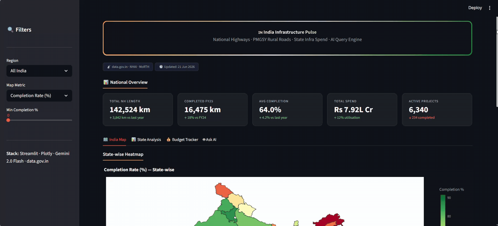
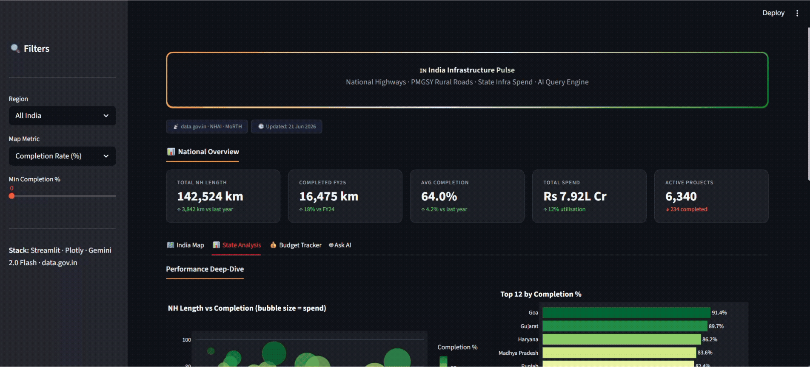
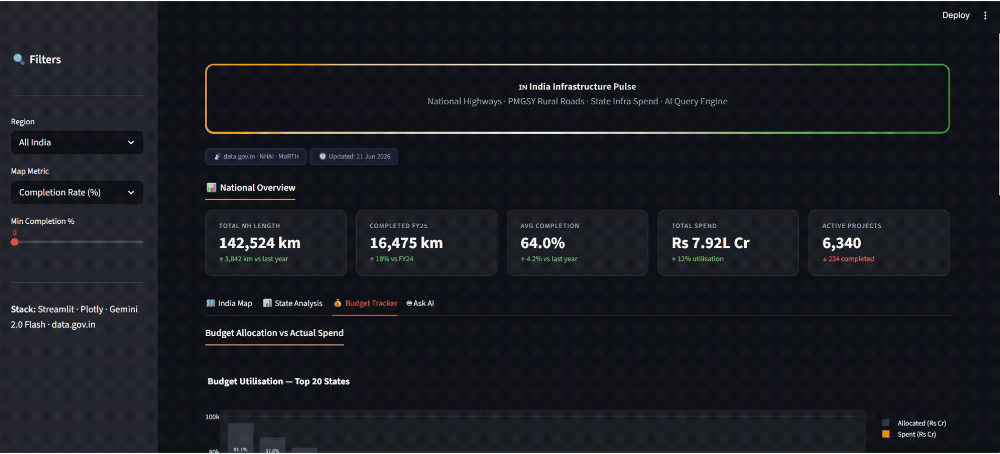
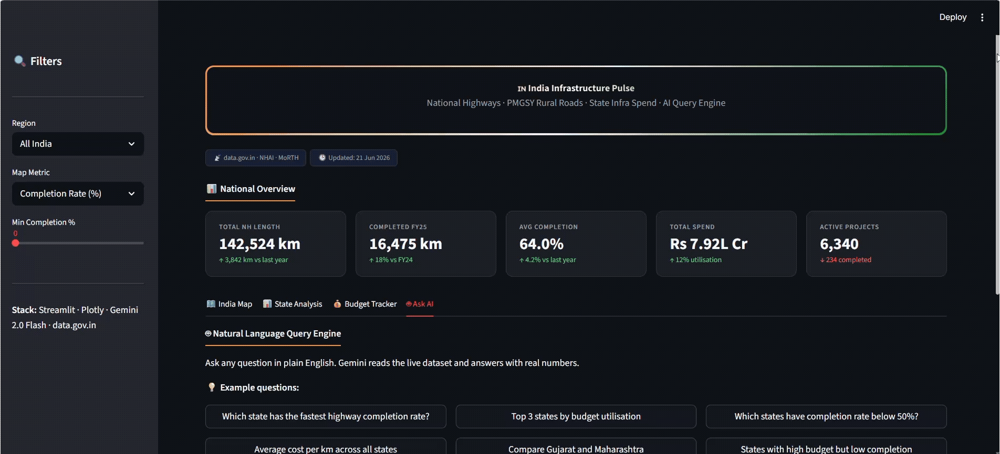

# 🇮🇳 India Infrastructure Pulse

> A live, interactive dashboard tracking National Highway construction, PMGSY rural road progress, and state-wise infrastructure budget utilisation across all Indian states — powered by a Gemini AI natural language query engine.


---

## 📌 Project Overview

India Infrastructure Pulse is a data analytics dashboard that makes India's road infrastructure data accessible and queryable in plain English. Instead of digging through government PDFs, users can simply ask questions like *"Which state has the highest completion rate?"* or *"Compare Gujarat and Maharashtra"* and get instant, data-backed answers.

The dashboard covers **29 Indian states** with metrics sourced from:
- **NHAI Annual Report 2024-25** — National Highway length, km completed, active projects
- **MoRTH Annual Report 2024-25** — Budget allocation and actual expenditure
- **PMGSY Official Dashboard** — Rural road completion data

---

## ✨ Features

- 🗺️ **Interactive India Choropleth Map** — State-wise heatmap with 5 switchable metrics (Completion Rate, NH Length, Budget Spent, PMGSY Roads, Active Projects)
- 📊 **State Performance Analysis** — Scatter plot, bar chart, and FY20–FY25 construction trend line
- 💰 **Budget Tracker** — Side-by-side allocation vs. spend with colour-coded utilisation rates
- 🤖 **Ask AI (NL Query Engine)** — Type any plain-English question → Gemini 2.5 Flash Lite generates pandas code → executes against live data → returns human-readable answer with real numbers
- 🔍 **Region & Metric Filters** — Filter by North / South / East / West / Central India
- 📱 **Responsive Layout** — Works on desktop and tablet

---

## 🎬 Demo

### 🗺️ India Map — State-wise Heatmap


### 📊 State Analysis — Performance Deep-Dive


### 💰 Budget Tracker — Allocation vs Spend


### 🤖 Ask AI — Natural Language Query Engine


---

## 🛠️ Tech Stack

| Layer | Technology |
|-------|-----------|
| Frontend / UI | Streamlit |
| Charts & Maps | Plotly (choropleth, scatter, bar, line) |
| AI Query Engine | Google Gemini 2.5 Flash Lite |
| Data Processing | Pandas |
| Data Source | NHAI + MoRTH Annual Report 2024-25 |
| Environment | python-dotenv |
| Deployment | Streamlit Community Cloud |

---

## 📁 Project Structure

```
india-infra-pulse/
│
├── assets              ← Demo GIFs
├── app.py              ← Main Streamlit app (UI, tabs, charts, map)
├── data_fetcher.py     ← Data loading (NHAI/MoRTH 2024-25 dataset)
├── nl_query.py         ← Gemini NL query engine
│
├── requirements.txt    ← Python dependencies
├── .env                ← API keys (never push to GitHub)
├── .env.example        ← Safe template for .env
├── .gitignore          ← Ignores .env, venv/, __pycache__
└── README.md           ← This file
```

---

## ⚡ Quick Start

### Prerequisites
- Python 3.10+
- A free Gemini API key from [aistudio.google.com/apikey](https://aistudio.google.com/apikey)

### Installation

```bash
# 1. Clone the repository
git clone https://github.com/YOUR_USERNAME/india-infra-pulse.git
cd india-infra-pulse

# 2. Create and activate virtual environment
python -m venv venv
venv\Scripts\activate        # Windows
source venv/bin/activate     # Mac/Linux

# 3. Install dependencies
pip install -r requirements.txt

# 4. Set up environment variables
cp .env.example .env
# Open .env and add your Gemini API key

# 5. Run the app
streamlit run app.py
```

Open your browser at **http://localhost:8501** 🚀

---

## 🔑 Environment Variables

Create a `.env` file in the root folder:

```env
GOOGLE_API_KEY=your_gemini_api_key_here
```

Get your free Gemini API key at 👉 [aistudio.google.com/apikey](https://aistudio.google.com/apikey)

> ⚠️ Never commit your `.env` file to GitHub. It is already listed in `.gitignore`.

---

## 🤖 How the AI Query Engine Works

```
User types a question in plain English
        ↓
Gemini 2.5 Flash Lite receives the question + dataset schema
        ↓
Gemini generates pandas Python code to answer the question
        ↓
Code is executed safely against the real DataFrame
        ↓
Human-readable answer returned with real numbers and units
        ↓
Generated code shown in expandable section for transparency
```

**Example questions you can ask:**
- *"Which state has the highest highway completion rate?"*
- *"Top 5 states by budget utilisation"*
- *"Which states have completion below 50%?"*
- *"What is the average cost per km across all states?"*
- *"Compare Punjab and Haryana"*
- *"States with high budget but low completion"*

---

## 📊 Data Sources & Accuracy

| Metric | Source | Year |
|--------|--------|------|
| NH Length (km) | NHAI Annual Report | 2024-25 |
| km Completed FY25 | NHAI Annual Report | 2024-25 |
| Completion Rate (%) | NHAI + MoRTH | 2024-25 |
| Budget Allocated | MoRTH Annual Report | 2024-25 |
| Budget Spent | MoRTH Annual Report | 2024-25 |
| PMGSY Roads (km) | PMGSY Dashboard | 2024-25 |
| Active Projects | NHAI Project Tracker | 2024-25 |

> **Note: Data was manually curated from official NHAI and MoRTH 2024-25 Annual Reports. The data.gov.in API was evaluated but not used as its road datasets were last updated in 2017.**

---

## ☁️ Deploy on Streamlit Cloud (Free)

```bash
# 1. Push to GitHub
git init
git add .
git commit -m "Initial commit: India Infrastructure Pulse"
git remote add origin https://github.com/YOUR_USERNAME/india-infra-pulse.git
git push -u origin main
```

2. Go to **[share.streamlit.io](https://share.streamlit.io)**
3. Click **New app** → select your repo → set `app.py` as main file
4. Go to **Advanced Settings → Secrets** and add:
```toml
GOOGLE_API_KEY = "your_actual_key_here"
```
5. Click **Deploy** → live public URL in ~2 minutes ✅

---

## 🚀 Future Improvements

- [ ] Connect to live PMGSY scraper for real-time rural road data
- [ ] Add district-level drill-down map
- [ ] Export answers and charts as PDF report
- [ ] Add year-over-year comparison (FY23 vs FY24 vs FY25)

---

## 👤 Author

**Nilesh**
- GitHub: [@nileshchaudhary16](https://github.com/nileshchaudhary16)

---

## 📄 License

This project is licensed under the MIT License — feel free to use, modify and distribute.

---

## 🙏 Acknowledgements

- [NHAI](https://nhai.gov.in) — National Highways Authority of India
- [MoRTH](https://morth.nic.in) — Ministry of Road Transport & Highways
- [PMGSY](https://pmgsy.nic.in) — Pradhan Mantri Gram Sadak Yojana
- [Google Gemini](https://ai.google.dev) — AI query engine
- [Streamlit](https://streamlit.io) — Dashboard framework
- [Plotly](https://plotly.com) — Interactive visualisations

